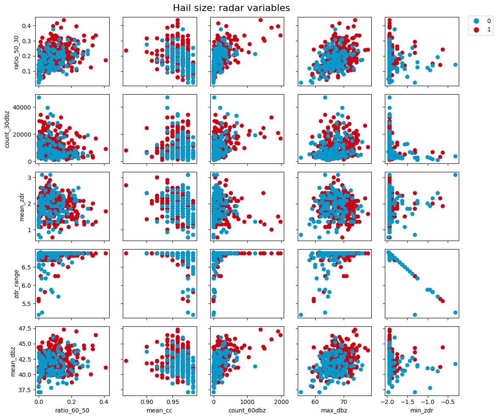
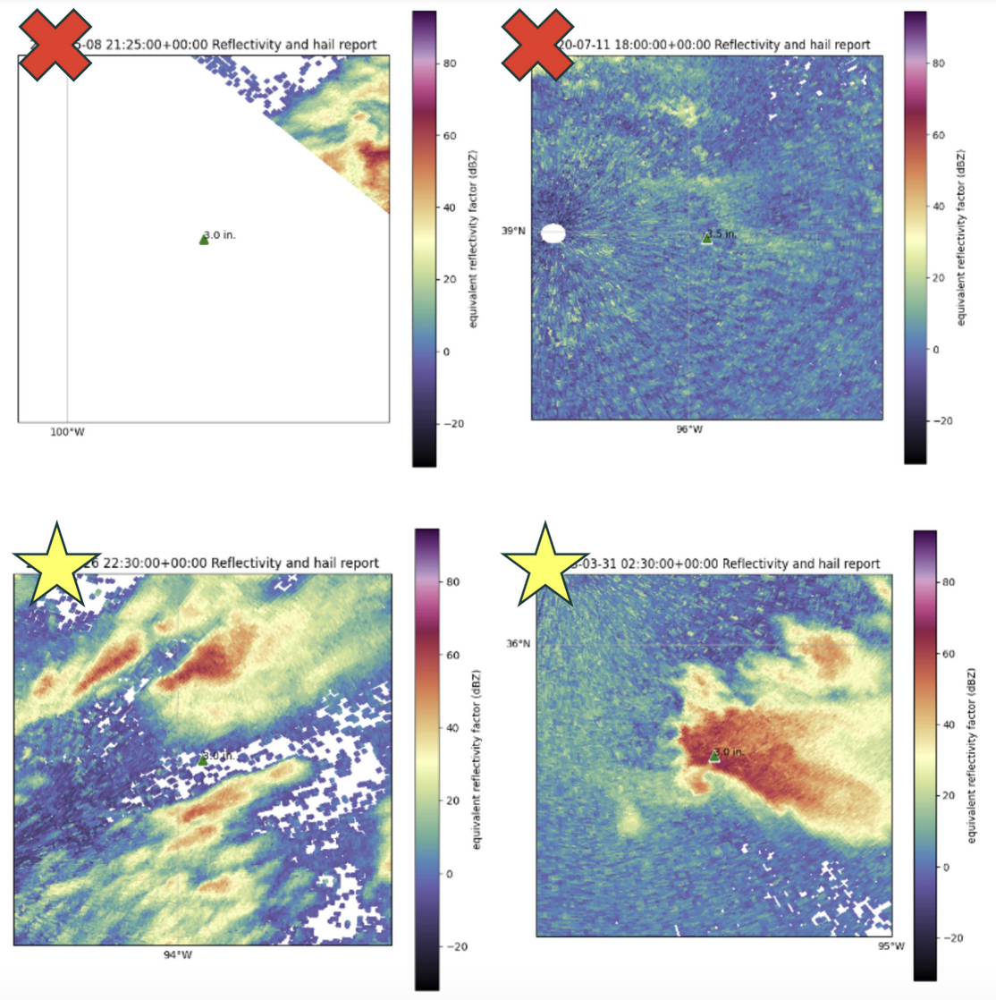
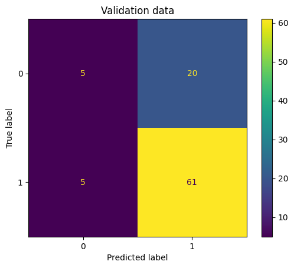
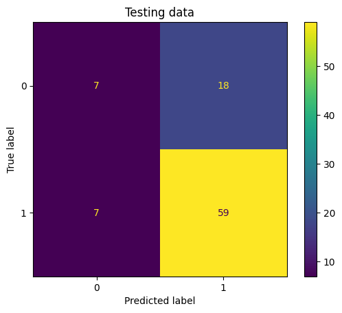

# Detecting Significant Hail from Radar Imagery Using a Random Forest Classifier

June Graff<sup>1</sup>, Chase Hunter<sup>1</sup>

<sup>1</sup> Northern Illinois University

### Abstract


### Usage & Replicability:

This repository contains three python notebooks, labeled by their order in the project workflow. 
1. PRE-PROCESSING: Starting with a hand-compiled list of NEXRAD radar locations and the SPC's hail report database and ending with a filtered, processed version that may then be used to gather radar data and continue the next steps.
2. RADAR & VERIFICATION: Using the intermediate hail dataset (either found in the OneDrive or obtained from running notebook 1), relevant radar imagery is downloaded for each report and manually verified by the user. Afterwards, with a list of the indices the user deems to be valid radar imagery, features are calculated and saved in a final version of the dataset.
3. RANDOM FOREST: With the final version of the dataset including all calculated features, the random forest model is trained, improved, and finally evaluated.

Our results can be replicated by following through the notebooks included in this repository. All necessary data can be freely downloaded from the public OneDrive in the availability statement. Each notebook contains instructions for downloading the necessary data, listing which files should be uploaded.

### Significance Statement

Doppler radar data is central to our understanding of severe thunderstorms. Despite this, current algorithms that detect hail size from radar are often very inaccurate, which is an obstacle to meteorologists' ability to issue accurate warnings or conduct research. Improving upon existing algorithms could improve accuracy of severe thunderstorm warnings, more appropriately informing people in harm's way. It could also improve our understanding of severe hail as a whole, by creating more accurate datasets than what currently exists, reducing errors and uncertainty in scientists' findings.

### 1. Background & Motivation

A recurring problem in operational meteorology is predicting hail size with only radar data. The National Weather Service issues severe thunderstorm warnings for storms with radar-indicated hail surpassing the severe threshold (1.0 in), but issues stronger tags (considerable; destructive) for larger, significant-severe hail. The “now-casted” hail size can be an important factor in warnings, helping residents understand the danger that approaches and allowing them to act more effectively. 

In lieu of reports from the public or trained weather spotters, meteorologists are left with radar data from which they can estimate hail size themselves, or alternatively, employ algorithms or techniques aid in their estimation (Donavon & Jungbluth, 2007). One commonly used algorithm using radar data is MESH (Maximum Estimated Size of Hail). MESH has room to improve, having been found to greatly overestimate larger hail sizes in even a high-resolution hail report dataset (Wilson et al., 2009).  

Besides operational meteorology, this also has implications in hail research. One of the authors has experienced firsthand how limited even the best large-scale “ground truth” hail report datasets can be in several contexts, from investigating hail size associated with left-moving supercells to working towards building a hail “risk surface”. Should a more accurate way to predict hail from radar be developed, one could in theory construct a dataset of large spatial and temporal scale that could stand in for observations (or supplement them) with less uncertainty than MESH. 

To improve on algorithms like MESH, we aim to use machine learning. This is a more flexible approach that can take into account more factors than just the maximum reflectivity value or environmental temperature profile.  

### 2. Data & Methods

Our source of hail reports is the Storm Prediction Center, which compiles reports of severe hail across the United States into a database dating back to 1955. This database includes the date, time, location, and magnitude (size) of each hail report, which is sufficient for us to gather radar data and compare it to the reported hail size. 

The first step is pre-processing. Due to an excess of data and considering time constraints imposed by radar availability, we have chosen to only use hail reports during the 10-year period of 2011-2020. To ensure reliable quality of radar imagery, we also need to find the NWS WSR-88D radar site nearest to each report as well as its distance, filtering out reports that are too far to have high-resolution imagery. 

Next, we must download radar data from each report. This is simply the scan closest to the time the report was sent, taken from the radar nearest to the report. This will come from the NWS’ archived level II data, which is downloaded automatically with a script provided courtesy of Brandon Weart, with editions made to fit our project's specific needs.

Once radar imagery is obtained, we will begin by clipping the scan to only preserve where DBZ ≥ 30. While higher thresholds like 45dBz are typically used to identify hail cores (Tang et al., 2014), this more conservative approach may allow factors like storm mode to be better represented. From there, we will calculate features for our ML model, such as maximum and minimum ZDR, average DBZ, and area of ≥30dBz, ≥50dBz, etc. 

We originally planned to use a KMeans clustering model to differentiate between the hail sizes suggested by our radar-derived features. Rather than predict exact hail size, we also set out dividing hail size into four bins: 1-2 inches, 2-3 in, 3-4 in, and 4+ in. This binned approach is more natural for KMeans, which would be able to find clusters for each hail size bin. To find the best model possible, we first separate training, validation, and final testing data from our dataset. These were separated by year and compared to the full dataset to ensure they are each representative. The training data will be used to train the KMeans model, the validation data to make initial predictions and tweak the model, and the testing data to evaluate the finished model’s performance. 

Despite our initial plans, we quickly realized the the KMeans approach was not suitable. As is clear in Fig. 1 below, there was no combination of features that resulted in clear clusters that discriminated between severe (1-2") and significant-severe (2+”) hail reports, let alone our initial goal of 1-inch size bins. This finding meant the project had to be pivoted in two distinct, significant ways.


Figure 1: Radar-derived features of severe and significant-severe hail reports.

<br>

Firstly, it was clear that KMeans was not the correct choice of model for this question. Instead, we selected a random forest classifier model. We found the random forest classifier to significantly outperform the KMeans model and a single decision tree. More details about model selection rationale and improvement are in the Results section.

The second pivot we had to make was adjusting expectations for our classifier. We had hoped to continue the binned approach (1-2", 2-3", etc.) to provide more operationally useful estimates of hail size, but training the random forest with this data yielded very poor results and we could not manage an F1-score higher than 0.45. This is due to the small sample size, which was especially prevalent in larger hail sizes. Our classifier tended to vastly overestimate hail size, predicting 3-4" or 4+” for cases that were in reality nowhere near that size. Recognizing this, we changed course towards the more feasible goal of only determining severe and significant-severe hail. 

Using the code below, the random forest model was trained using only data from 2011-2016, validated and adjusted with data from 2017-2018, then given its final test with data from 2019-2020. These subsets were separated by year to ensure their independence, which is critical to the integrity of our model.

```
hail_train = hail_data[hail_data['yr'] <= 2016]
hail_val = hail_data[(hail_data['yr'] == 2017) | (hail_data['yr'] == 2018)]
hail_test = hail_data[(hail_data['yr'] == 2019) | (hail_data['yr'] == 2020)]
```


### 3. Feasibility

While some similar projects have been done before (Ortega et al. 2016), we could not find any previous research on this exact concept, i.e. applying machine learning directly to radar imagery alone to estimate hail size.  

Both of us at least have part of the requisite knowledge and feel that we will be able to learn everything we need to as we go. Specifically, both of us have used Python before and passed EAE 493, but we currently lack experience in machine learning. We believe that over the course of the semester, we will be able to learn enough both from this course and from our own trial and error that this project is feasible. Also of note, one of us has used Python more extensively in a research setting, making adaptation to this course project smoother.  

This project will make use of as much hail report data as we can get our hands on. The SPC hail report database is a 43 MB file containing data from over 400,000 hail reports. We will not be using nearly all of these reports, though—due to the large temporal variation, many thousands of reports in this dataset would not have radar data from which we can calculate our variables. Additionally, we aim to filter reports based on the availability of radar data as well as reports’ proximity to the radar site, ensuring quality of data and that the scans we use are of similar elevation. 

While we have not worked with machine learning before, we will learn about its use in this course and we feel we will be able to learn on our feet. We have a picture of what we want to accomplish, and clear focus on what steps we can take to complete those goals. Although a central focus of the project is machine learning, a topic in which neither of us are experienced, we are both familiar with Python and are confident that we are already able to perform every other task necessary for completing this project. Thus, we feel this project is appropriate for our level of experience – it will challenge us and force us to learn, but at the same time we do not expect to be overwhelmed. 

### 4. Potential Issues

The main issue we expect to face is the lack of experience in machine learning. Both group members have experience in Python, but none in machine learning. We will have to learn a lot as we go and may need to adapt already existing parts of our project as we learn more about how to efficiently use machine learning. 

Beyond that, we might run into issues with the quality of the data we’re working with. While the SPC hail report dataset is quality-controlled, there might still be issues with the timing of the reports being variable, not necessarily lining up with the most suitable radar timestamp for analysis. Furthermore, since the database is composed of crowdsourced, public reports which will be inconsistent by nature, the hail reports we analyze may not always capture the true intensity of the storm we analyze. 

The radar data may have issues of its own. We are not entirely sure that all radar files going back to the beginning of our dataset will include all products we’re looking for. We don’t know when exactly dual-pol products like ZDR and CC were first made available or if they became available on all radar sites around the same time, but if any of our radar data is missing that we will have to exclude it to be able to calculate all variables for all data points. 

### 5. Timeline

<table border="1">
  <thead>
    <tr>
      <th>Task</th>
      <th>Estimate</th>
      <th>Confidence</th>
      <th>Notes</th>
    </tr>
  </thead>
  <tbody>
    <tr>
      <td>Gather report and radar data</td>
      <td>&lt; 1 week</td>
      <td>Great (4/4)</td>
      <td>SPC report data already acquired, we need to figure out how to download data.</td>
    </tr>
    <tr>
      <td>Preprocess report data</td>
      <td>2 weeks</td>
      <td>Good (3/4)</td>
      <td>We have done similar preprocessing before, but difficulty may come from calculating the distance between reports and radar sites.</td>
    </tr>
    <tr>
      <td>Train ML model; get swath data</td>
      <td>4 weeks</td>
      <td>Poor (1/4)</td>
      <td>Neither of us have trained a machine learning model before and this will be a learning experience.</td>
    </tr>
    <tr>
      <td>Further analysis with swaths</td>
      <td>2 weeks</td>
      <td>Fair (2/4)</td>
      <td>How much analysis (swath characteristics/climo, MESH, etc) we can do depends on how long the previous step takes, so it’s hard to be sure of the timeline.</td>
    </tr>
    <tr>
      <td>Write report</td>
      <td>1 week</td>
      <td>Fair (2/4)</td>
      <td>One group member has done limited scientific writing and the other has no experience.</td>
    </tr>
  </tbody>
</table>
Table 1: Project timeline

<br>

### 6. Results

One (partially) unforeseen obstacle was the unreliability of radar data. While some files indeed lacked the ZDR and CC products we were looking for, removing those was trivial. The greater issue was that some scans were, in the area around our report, completely empty, partially empty (with an unnatural straight line cutting everything off suggesting some sort of corrupted or malformed data), or clearly representing a delayed report (no appreciable reflectivity returns near the report, which was likely sent after the storms moved out or dissipated). To mitigate this, we ended up having to manually verify several hundred reflectivity images. This was very time-consuming and bottlenecked our process, leaving us with a decreased (but verified) sample.


Figure 2: From the manual verification process, the top two radar images were rejected for being incomplete or clearly delayed/mismatched. The bottom two were accepted as the domain contains reflectivity returns plausibly matching the hail report, even if the report was slightly delayed.

<br>

As discussed previously, we pivoted away from the KMeans clustering model to instead use a random forest classifier, which we found was more suited to the task. Perhaps due to the sporadic nature of public reports as well as some sources of error that will be mentioned later, no clear clusters could be formed between any two features we developed. Changing our approach, we settled on a random forest classifier model.

The random forest is a type of supervised machine learning that involves an ensemble of decision trees trained on different subsets of data all voting on the resultant class (Breiman 2001). While more computationally expensive, they are better than single decision trees at capturing more complex relationships between features and show an improvement in accuracy for classification tasks like this one as compared to single decision trees.

A difficulty we did not anticipate was, as mentioned previously, the model performing very poorly with the original four hail size bins. Our small sample did not contain nearly enough cases to properly represent the larger bins, leading to hail size often being greatly overestimated. Early iterations of the model received F1-scores near 0.45, which is inadequate. To compensate, we moved our goalposts to instead only worry about sig-severe versus non-sig-severe hail (above or below the threshold of 2 inches). After reviewing expectations and updating our model, we received an initial F-score of 0.68 for our validation data.

We then improved the model by testing different configurations of hyperparameters. Looping through about seventy combinations (from the lists in the code chunk below) and picking the most skillful one by F1-score, our final random forest model received an F1-score of 0.68 for the validation data. This is far from ideal but shows notable improvement from previous iterations. Our model configuration of choice used max_depth = 10, n_estimators = 200, min_samples_leaf = 1, and max_features = log2.

```
max_depth = [3, 5, 7, 10]
n_estimators = [50, 100, 200]
min_samples_leaf = [1, 2, 5]
max_features = ['sqrt', 'log2']
```

Finally, predicting our testing subset with the random forest classifier yielded an F1-score of 0.70. Notably, as seen in Fig. 3 below, the model more often overestimates than underestimates hail size, i.e. it is more likely to erroneously predict significant-severe hail. While the exact numbers are different, a similar bias is seen in MESH, in which we observe more erroneous predictions of large hail than we do of small hail (Wilson et al., 2009). Further comparison to MESH is regrettably difficult due to our pivot away from predicting actual hail size.



Figure 3: confusion matrices for validation and testing data. The F1-scores were 0.68 and 0.70, respectively.

<br>

It is unclear how far this model can be improved given the limitations of public hail reports themselves, but we do believe we have identified some sources of error that could be improved in the future. As alluded to previously, a single randomly selected report does not consistently represent a storm. It could be the peak hail size, some of the smallest hail, or somewhere in-between. A future step we did not previously consider would be to verify that only the largest report from each individual storm would be used, i.e. removing all but the largest report that took place within a certain lat/lon and time. This would prevent some inconsistency in how well the randomly sampled report actually represents its storm. 

Furthermore, our ZDR-derived parameters showed very little ability to discern between hail sizes. Despite filtering out typically noisy values (>5 and <-2), the maximum and minimum ZDR tends to be almost identical for each storm (right up against either limit) even after masking to DBZ ≥ 30. This is likely due to the influence of noisy values even within the area influenced by convective precipitation. It is not clear how to fix this exactly, but we could in theory look at ZDR minima sustained over a broader area, eliminating the influence that single noisy pixels can have on overall max/mins.

Finally, this sample size is smaller than ideal for the task at hand. Due to the slow manual verification process and many radar files not having the products we wanted, our final sample consisted of 383 reports overall. Dedicating more time to verifying more radar imagery or building an automatic or hybrid verification system could prove fruitful. 

### 7. Summary & Discussion

We set  on hail size prediction from radar imagery hoping to improve our current algorithms like MESH that, while useful, have known biases and cannot be taken at face value. 

Our random forest classifier was trained using SPC’s hail report database and NWS-archived Level II radar imagery. It was iterated upon using separate training, validation and testing datasets and was selected as the best of many different possible configurations. Our model improved significantly since its inception but still leaves a lot to be desired. It currently earns an F-score of 0.70 with the testing dataset and shows a similar bias to MESH, the very MRMS product we sought to improve upon. 

The most important single change that future work may benefit from is a larger sample size, as alluded to previously. A larger manually verified dataset should be compiled, or a hybrid or automatic verification system should be developed. Cases should be chosen not from the 2011-2020 period we selected, but from something closer to 2015-2024, if the 10-year time frame is still desired. This is to avoid cases in the early 2010s before dual-polarization products were fully implemented. Finally, future work may more closely examine the most important variables to our random forest model, which have the largest impact on hail size prediction. The patterns of false negatives/positives may also shed light on what more can be done to improve the model.

This model or a similar one could in theory be applied automatically, unlike more manual heuristics (such as Donavon & Jungbluth, 2007), which could ease the burden on a warning meteorologist. It could also aid in hail research to create climatologies similar to what is already available using MESH (Murillo et al., 2021; Cintineo et al., 2012). Still, there are improvements to be made before it is suitable for operational use.

### Availability Statement

The data needed for this project can be freely downloaded from <a href="https://niuits-my.sharepoint.com/:f:/g/personal/z2046057_students_niu_edu/IgARaqWHMUw7QpUnIpZPGc8KARJWsmG79ckiXBSJVaEPzP0?e=uYpbig">this public OneDrive</a>. `hail_v4.csv` is the final version of the file we used to train our model, and all data in it have been manually verified by the authors. To reproduce our process, you may download `1955-2024_hail.csv`, which is identical to the file found on <a href="https://www.spc.noaa.gov/wcm/#data">SPC's severe weather database page</a>.

### Acknowledgements

The authors would like to thank Dr. Haberlie for his guidance and patience during this project, and Brandon Weart for his contributions to the radar-downloading script.

### References

Breiman, L., 2001: Random Forests. Machine Learning, 45, 5–32, https://link.springer.com/article/10.1023/A:1010933404324.

Cintineo, J. L., T. M. Smith, V. Lakshmanan, H. E. Brooks, and K. L. Ortega, 2012: An Objective High-Resolution Hail Climatology of the Contiguous United States. Wea. Forecasting, 27, 1235–1248, https://doi.org/10.1175/WAF-D-11-00151.1. 

Donavon, R. A., and K. A. Jungbluth, 2007: Evaluation of a Technique for Radar Identification of Large Hail across the Upper Midwest and Central Plains of the United States. Wea. Forecasting, 22, 244–254, https://doi.org/10.1175/WAF1008.1. 

Murillo, E. M., C. R. Homeyer, and J. T. Allen, 2021: A 23-Year Severe Hail Climatology Using GridRad MESH Observations. Mon. Wea. Rev., 149, 945–958, https://doi.org/10.1175/MWR-D-20-0178.1. 

Ortega, K. L., J. M. Krause, and A. V. Ryzhkov, 2016: Polarimetric Radar Characteristics of Melting Hail. Part III: Validation of the Algorithm for Hail Size Discrimination. J. Appl. Meteor. Climatol., 55, 829–848, https://doi.org/10.1175/JAMC-D-15-0203.1. 

Tang, L., J. Zhang, C. Langston, J. Krause, K. Howard, and V. Lakshmanan, 2014: A Physically Based Precipitation–Nonprecipitation Radar Echo Classifier Using Polarimetric and Environmental Data in a Real-Time National System. Wea. Forecasting, 29, 1106–1119, https://doi.org/10.1175/WAF-D-13-00072.1.  

Wilson, C. J., Ortega, K., Lakshmanan, V., 2009: Evaluating Multi-Radar, Multi-Sensor Hail Diagnosis with High Resolution Hail Reports. https://caps.ou.edu/reu/reu08/finalpapers/Wilson-finalpaper.pdf.
